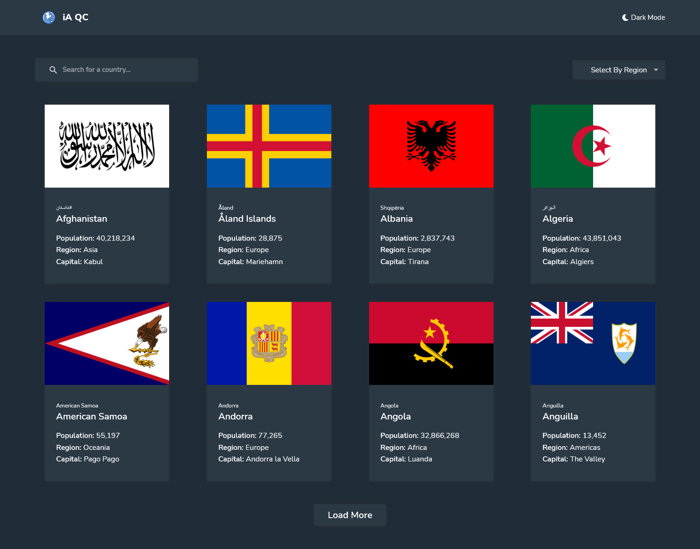

# REST Countries API with color theme switcher solution

This is a solution to the [REST Countries API with color theme switcher challenge on Frontend Mentor](https://www.frontendmentor.io/challenges/rest-countries-api-with-color-theme-switcher-5cacc469fec04111f7b848ca). Frontend Mentor challenges help you improve your coding skills by building realistic projects.

## Authors

- [@mhistiak3](https://github.com/mhistiak3)

  
## Screenshots



  
### Built with

- Semantic HTML5 markup
- CSS custom properties
- Flexbox
- CSS Grid
- Mobile-first workflow
- [React](https://reactjs.org/) - JS library
- React Icons
- RestCountries API


  
## Run Locally

Clone the project

```bash
  gh clone https://github.com/mhistiak3/Modern-PWA-TODO.git
```

Go to the project directory

```bash
  cd countries-api
```

Install dependencies

```bash
  npm install
```

Start the server

```bash
  npm start
```

  

